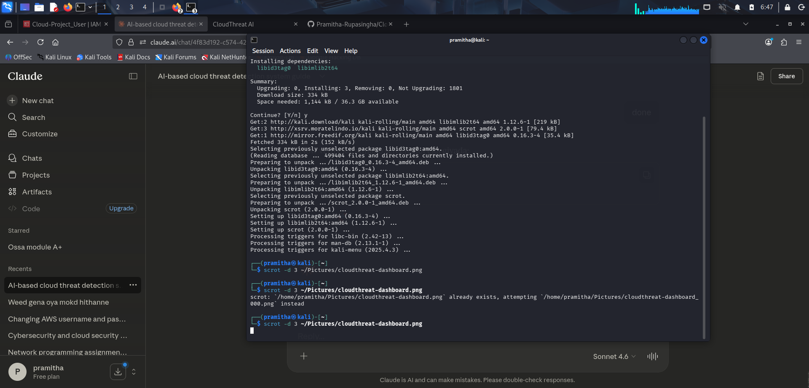

# 🛡️ CloudThreat AI
### AI-Powered Cloud Threat Detection System



## 🔍 Overview
CloudThreat AI is a real-time cloud security monitoring system that uses Machine Learning to detect anomalous and suspicious activity in AWS environments. Built for SOC-level threat detection using CloudTrail logs and Isolation Forest algorithm.

## ⚡ Features
- 🔴 **Real-time threat detection** using AWS CloudTrail & CloudWatch
- 🤖 **ML-powered anomaly detection** via Isolation Forest algorithm
- 🌐 **Live cyber security dashboard** built with Flask
- 📊 **Behavioral analysis** — unusual hours, unknown IPs, error patterns
- ☁️ **AWS native integration** via boto3 SDK

## 🛠️ Tech Stack
| Component | Technology |
|-----------|-----------|
| Cloud Platform | Amazon Web Services (AWS) |
| Log Collection | AWS CloudTrail, CloudWatch |
| ML Algorithm | Isolation Forest (scikit-learn) |
| Backend | Python, Flask |
| AWS SDK | boto3 |
| Data Processing | pandas, numpy |

## 📁 Project Structure
CloudThreatAI/
├── main.py              # Main runner
├── log_fetcher.py       # AWS CloudTrail log collector
├── threat_detector.py   # ML anomaly detection engine
├── dashboard/
│   ├── app.py           # Flask web server
│   └── templates/
│       └── index.html   # Cyber security dashboard UI
├── logs/                # Fetched AWS logs
├── alerts/              # Detected threats
└── screenshots/         # Dashboard preview

## 🚀 Setup & Installation
```bash
# Clone the repository
git clone https://github.com/Pramitha-Rupasingha/Cloudthreat-AI.git
cd Cloudthreat-AI

# Create virtual environment
python3 -m venv venv
source venv/bin/activate

# Install dependencies
pip install boto3 pandas scikit-learn flask

# Configure AWS credentials
aws configure

# Run the system
python3 main.py

# Launch dashboard
cd dashboard
python3 app.py
```

## 🎯 How It Works
1. **Log Collection** — Fetches real-time events from AWS CloudTrail
2. **Feature Engineering** — Extracts behavioral features (hour, IP, error codes)
3. **ML Detection** — Isolation Forest scores each event for anomaly
4. **Dashboard** — Live cyber UI displays threats and event feed
5. **Alerts** — Detected threats saved to alerts/threats.json

## 👨‍💻 Author
**Pramitha Rupasingha**
2nd Year IT Undergraduate | SLIIT
Cybersecurity & Cloud Security Enthusiast

---
⭐ Star this repo if you found it useful!
